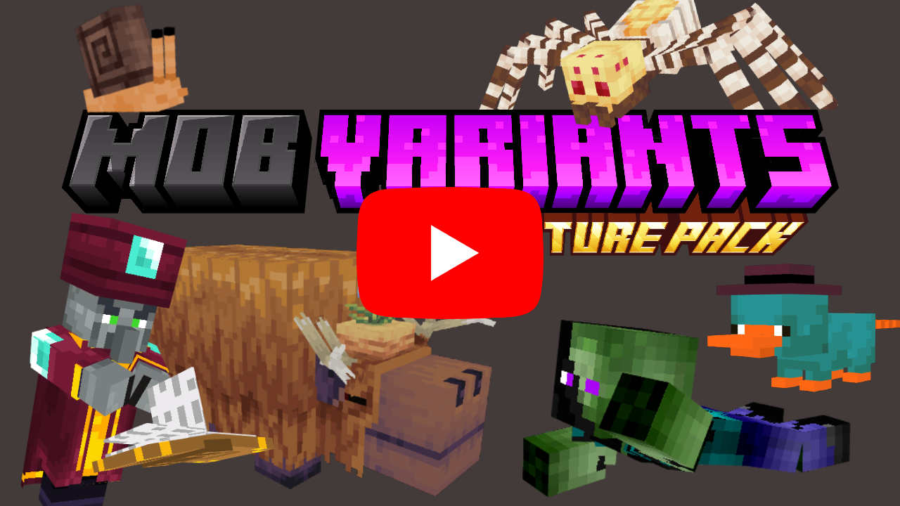

#  Mob Variants v4.0 – A Texture Pack for Minecraft Bedrock

  

🎨 **A Whole New Level of Diversity for Minecraft Bedrock!** 🧩  
Mob Variants is a texture pack designed to make your Minecraft world feel truly alive — adding hundreds of **new mob skins, models, attachables, and animations**, all carefully crafted to blend seamlessly with Minecraft’s vanilla aesthetic.

😩 Tired of seeing the same mobs over and over again?  
✨ Say goodbye to repetition! With:
- 🔹 **400+ unique mob skins**
- 🔹 **50+ brand-new models**
- 🔹 **37,850+ possible combinations**  
...you’ll rarely see the same mob twice again!

## 🎬 **Trailers on YouTube**

<table>
  <tr>
    <td align="center">
      
    </td>
    <td align="center">
      
    </td>
  </tr>
</table>

## 🛠️ **Choose how you want to play:**

| 🧾 **Resource Pack only** | 🧾➕⚙️ **Resource Pack + Optional Behaviour Pack (BP)**  ✅ Recommended |
|---------------------------|--------------------------------------------------------------------------------------|
| Mobs appear with random variants each time they render. | Mob appearances are *fixed and consistent* for all players, even if you leave the area or reload the game. Perfect for multiplayer, roleplay, and mapmaking! |

✅ Fully vanilla-compatible (no experimental toggles)  
✅ Works seamlessly on servers and Realms  
✅ Other players don’t need to install anything!

## 🚀 **Mob Variants – Now Better Than Ever in v4.0!** 🚀

Mob Variants is a texture pack that transforms Minecraft Bedrock by adding **hundreds of unique mob skins**, **custom models**, and **dynamic features**, all while staying true to the vanilla style. Every update has added new layers of depth, variety, and polish to the experience.

### 🆕 **v4.0 – The Biggest Update Yet**
- Introduces an **optional Behaviour Pack** for consistent mob variants across all players.
- Adds **Sniffers that spawn with growing flowers**, new **Evoker variants from Minecraft Dungeons**, and **rare special mobs** with ultra-low spawn chances — like golden zombies, chest pigs, and clown vindicators.
- Improves existing mobs with visual refinements and bug fixes.

### 🔁 **v3.0 – Dynamic Touches**
- Added lot of mobs with **weapons, armor, and attachments**.
- Added **random arrows, helmets, and props** to enhance realism.
- Introduced **basic animations** and themed models like miners and archers.

### 🌈 **v2.0 – Massive Variety**
- Expanded to **over 200 skins**.
- Included mobs inspired by **Minecraft Dungeons**.
- Began experimenting with **rare variants** with new models, glowing textures and attachments.

### 🎨 **v1.0 – The Beginning**
- Core concept introduced: **visual variety for mobs** without changing gameplay.
- Launched with **basic randomized skins** and full vanilla compatibility.

Each version has pushed the boundaries of what mobs can look like — and **v4.0 brings it all together** in the most polished, dynamic version yet.

## 🎮 **Why Use Mob Variants v4.0?**
✔ **More visual variety in mobs** – never see the same default skins again!  
✔ **Fully Vanilla-compatible** – no experimental features required.  
✔ **Perfect for servers & Realms** – works for all players without extra downloads.  
✔ **No performance loss** – optimized to run smoothly on all devices.  

🔗 **Try it out and transform your Minecraft experience!**  
📺 *Don't miss the trailer to see the update in action!*
